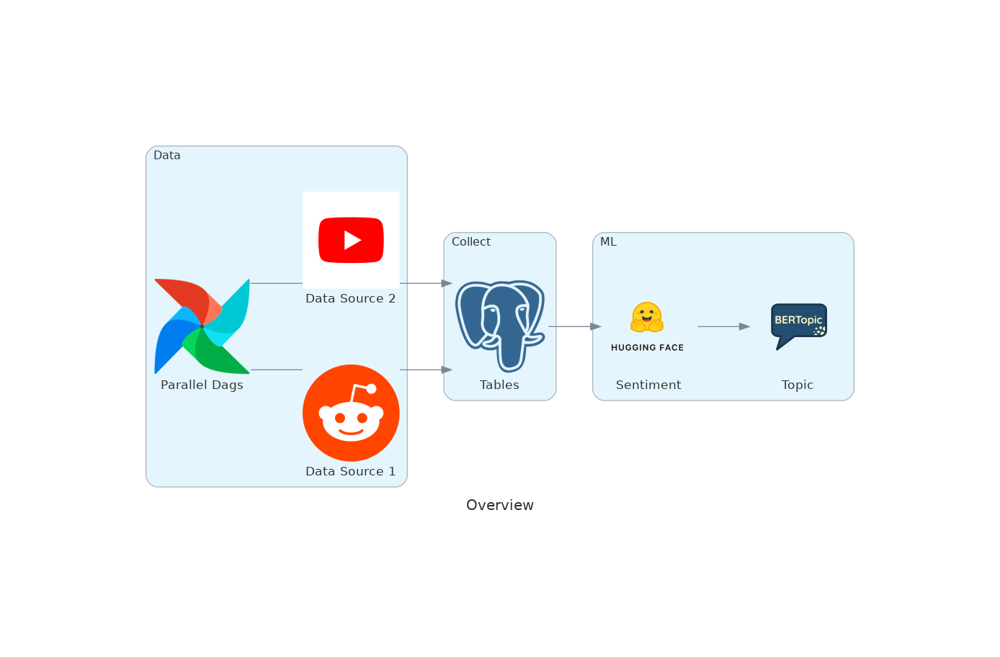

# What's going on in the business world?

The idea behind this project is to understand current topics and sentiments in bussiness/startup culture. 
Current discussions are pulled from related subreddits and comments from Forbes YouTube video comments.
In the future I plan to add a news scraper. This project uses the BERT family of models which is not the most cutting edge 

### Prerequisites

If working on windows, visual studio community with C++ extension may be required for the modeling script to run (I believe this is due to the HDBSCAN package).
PyTorch may also be required as the requirements probably contains a cuda version so it may not install if you do not have a GPU.
I used Postgres to load and store the data but that is optional.

- [vs_BuildTools](https://visualstudio.microsoft.com/downloads/?q=build+tools)
- [PyTorch](https://pytorch.org/get-started/locally/)
- [Postgres](https://www.postgresql.org/download/)

### Installing

To install dependencies (python 3.11)

    pip install -r requirements.txt

To obtain appropriate API keys follow the guides bellow. Mine were stored in a .env file.

    https://blog.hubspot.com/website/how-to-get-youtube-api-key
    https://www.jcchouinard.com/reddit-api/

